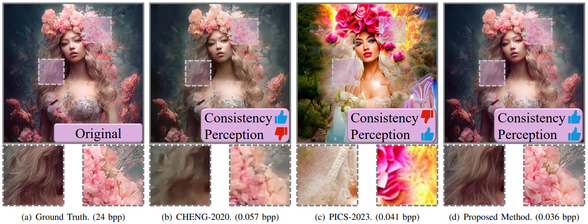
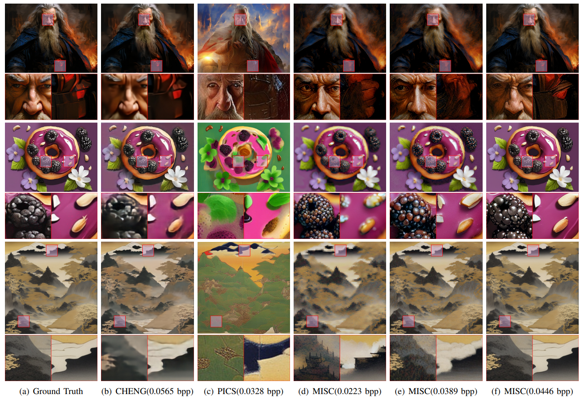

# MISC
**The official repo for [MISC: Ultra-low Bitrate Image Semantic Compression Driven by Large Multimodal Model](https://arxiv.org/abs/2402.16749)**

 

      
 
 

## Dependency

[GPT-4 Vision](https://openai.com/)

[CLIP_Surgery](https://github.com/xmed-lab/CLIP_Surgery/)

[Stable Diffusion 2.1](https://hf-mirror.com/stabilityai/stable-diffusion-2-1)

[DiffBIR](https://github.com/XPixelGroup/DiffBIR/)

[CompressAI](https://github.com/InterDigitalInc/CompressAI)

## Demo
[Feb 29, 2024] A simple Jupyter demo is uploaded. The encoder and decoder model weights will be uploaded soon.

## Visualzation Result

 

      
 
 

